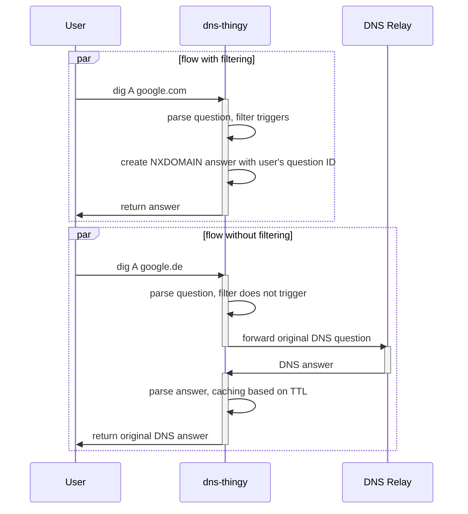

# dns-thingy

A minimal work-in-progress content filter system based on DNS similar to [AdguardHome](https://github.com/AdguardTeam/AdGuardHome).

This project serves the purpose to learn more about the [Domain Name System](https://en.wikipedia.org/wiki/Domain_Name_System).

This workspace project consists of the following subcrates in `crates`:

- `dns` - a library crate for constructing and consuming DNS packets (currently only supports DNS over UDP)
- `dns-client` - a minimal DNS client that wraps `dns` to test resolving `A` and `CNAME` records for a given domain name
  and optionally given upstream DNS server (default `1.1.1.1`)
- `dns-block` - a single-threaded DNS server that selectively proxies queries to `1.1.1.1` or blocks blacklisted domains based on a list
- `dns-block-threaded` - a multi-threaded version of `dns-block`
- `dns-block-tokio` - an async version of `dns-block` based on Tokio (not fully async at this point, as it uses blocking parts of `dns`)

## How to run

You can either clone and `cargo install -p dns-block-tokio` and then run `dns-block-tokio`
or use Docker (only `linux/amd64` images are being built by CI at the moment) by pulling the image
`docker run -p 53000:53000 maximumstock2/dns-thingy:latest`
which runs `dns-block-tokio` inside the container on port 53000 and makes it available on your host machine
on port `53000` as well. Optionally, use `-p 53:53000` to map your local port `53` to be used, but that most likely requires root privileges.

At that point `dns-thingy` can answer DNS queries, ie. `dig google.com @127.0.0.1 @53000`.

## TODO

- [ ] docs: model request flow and make sure we actually do the least amount of work
- [ ] optional caching
- [ ] feat: add custom blocking rules
- [ ] feat: cache records according to answer TTL
- [ ] feat: implement more record types
- [ ] api: request builder for DNS queries & responses
- [ ] bench
  - every commit on `master` should trigger a benchmark suite that collects the typical benchmark data, posts the data to the repository/GH Pages and builds a website with the results in a graph

## Performance Evaluation

I'd like to use this opportunity to create a performance benchmark setup to get a better
feeling for performance characteristics of different implementation strategies, such as:

1. Single-threaded blocking (current implementation of `dns-block`)
2. Multi-threaded blocking
3. Asynchronous based on Tokio

See [Benchmarks](benchmarks/README.md) for further information.

## Request Flow

Syntax: https://mermaid.js.org/syntax/sequenceDiagram.html

