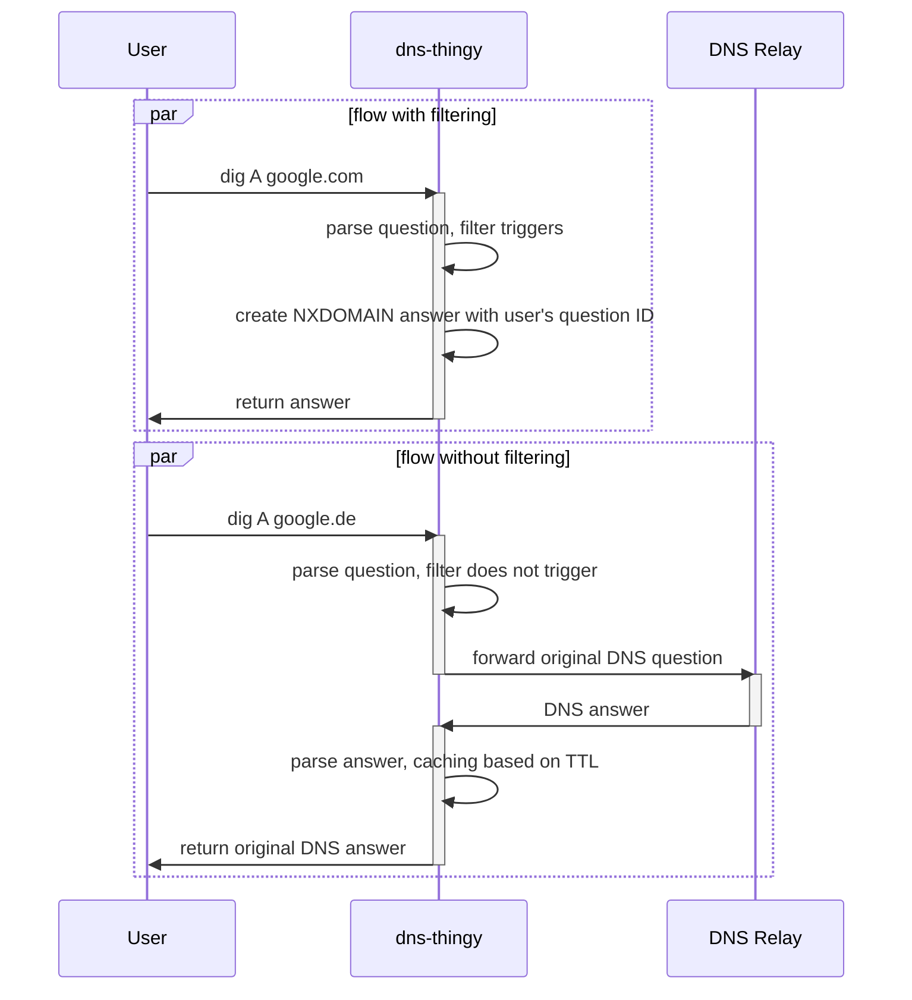

# dns-thingy

[](https://github.com/maximumstock/dns-thingy/actions/workflows/rust.yml)

A minimal work-in-progress content filter system based on DNS similar to [AdguardHome](https://github.com/AdguardTeam/AdGuardHome).

This project serves the purpose to learn more about the [Domain Name System](https://en.wikipedia.org/wiki/Domain_Name_System).

This workspace project consists of the following subcrates in `crates`:

- `dns` - a library crate for constructing and consuming DNS packets (currently only supports DNS over UDP)
- `dns-client` - a minimal DNS client that wraps `dns` to test resolving `A` and `CNAME` records for a given domain name
  and optionally given upstream DNS server (default `1.1.1.1`)
- `dns-block-tokio` - an async stub resolver based on Tokio

## How To Run

### From Source

You can clone this repository, install via `cargo install -p dns-block-tokio` and then run `dns-block-tokio`.

### Docker

The current CI pipeline builds and publishes Docker images (only for `linux/amd64` architecture) by pulling the image
`docker run -p 53000:53000 maximumstock2/dns-thingy:latest`

This runs `dns-block-tokio` inside the container on port 53000 and makes it available on your host machine
on port `53000` as well. Optionally, use `-p 53:53000` to map your local port `53` to be used, but that most likely requires root privileges.

At that point `dns-block-tokio` can answer DNS queries, ie. `dig google.com @127.0.0.1 @53000`.

## Configuration

See `dns-block-tokio --help` for the available options:

```bash
Usage: dns-block-tokio [OPTIONS]

Options:
  -d, --dns-relay <DNS_RELAY>
          DNS server to forward to

          [default: 1.1.1.1:53]

      --bind-address <BIND_ADDRESS>
          Port to listen on

          [default: 0.0.0.0]

      --bind-port <BIND_PORT>
          Port to listen on

          [default: 53000]

      --blocked-domains <BLOCKED_DOMAINS>
          Domains to block from being resolved

      --domain-blacklists <DOMAIN_BLACKLISTS>
          Source URLs for domain lists to block from being resolved

      --domain-rewrites <DOMAIN_REWRITES>
          Comma-separated tuples of `<domain>:<ip>` that describe how to resolve a domain to a static IP.

          The IPs can only be in IPv4 format as of now. The domains are not validated.

  -q, --quiet
          Whether to disable logging

  -c, --caching-enabled
          DNS response caching is enabled by default and can be explicitly disabled

      --benchmark
          Whether benchmark mode is enabled, ie. if forwarding should be skipped and to avoid network calls upstream

      --resolution-delay-ms <RESOLUTION_DELAY_MS>
          Milliseconds of resolution delay of DNS queries when `benchmarking = true`

          [default: 500]

  -r, --recording-folder <RECORDING_FOLDER>
          Folder path to save DNS query recordings to

  -h, --help
          Print help (see a summary with '-h')

  -V, --version
          Print version
```

### Rewriting & Blocking Domains

Rewriting or blocking domains can happen in a couple different ways. A request for a blocked domain will be answered with a `NXDOMAIN` DNS response.

1. You can rewrite single domains to hard-coded IPv4 addressses
2. You can hard-code blocked domains
3. You can pass an URL that resolves to a `text/plain` HTTP resource, similar to popular DNS blocklists online. Each listed domain name will be blocked.

```bash
dns-block-tokio \
  --domain-rewrites google.com:8.8.8.8 \
  --domain-rewrites google.de:1.1.1.1 \
  --domain-blacklists https://raw.githubusercontent.com/hagezi/dns-blocklists/blob/main/share/ad-shield.txt \
  --domain-blacklists https://raw.githubusercontent.com/hagezi/dns-blocklists/blob/main/share/ad-shield-subdomains.txt \
  --blocked-domains example.com
  --blocked-domains example2.com
```

### Caching

You can optionally enable caching by passing `--caching-enabled` when running `dns-block-tokio`.
This will cache the DNS responses from your configured upstream relay based on the lowest time-to-live
values across all resource records in the DNS reponse.

## TODO

- [ ] api: request builder for DNS queries & responses
- [ ] bench
  - every commit on `master` should trigger a benchmark suite that collects the typical benchmark data, posts the data to the repository/GH Pages and builds a website with the results in a graph

## Request Flow

Syntax: https://mermaid.js.org/syntax/sequenceDiagram.html


```mermaid
sequenceDiagram
    participant user as User
    participant forwarder as dns-thingy
    participant relay as DNS Relay

    %% flow with filtering
    par flow with filtering
      user->>forwarder: dig A google.com
      activate forwarder
      forwarder->>forwarder: parse question, filter triggers
      forwarder->>forwarder: create NXDOMAIN answer with user's question ID
      forwarder->>user: return answer
      deactivate forwarder
    end

    %% flow without filtering
    par flow without filtering
      user->>forwarder: dig A google.de
      activate forwarder
      forwarder->>forwarder: parse question, filter does not trigger
      forwarder->>relay: forward original DNS question
      deactivate forwarder
      activate relay
      relay->>forwarder: DNS answer
      deactivate relay
      activate forwarder
      forwarder->>forwarder: parse answer, caching based on TTL
      forwarder->>user: return original DNS answer
      deactivate forwarder
    end
```

## References

Some reading material that was helpful:

- https://datatracker.ietf.org/doc/html/rfc1035
- https://github.com/EmilHernvall/dnsguide/blob/master/chapter1.md
- https://blog.cloudflare.com/how-to-stop-running-out-of-ephemeral-ports-and-start-to-love-long-lived-connections/
